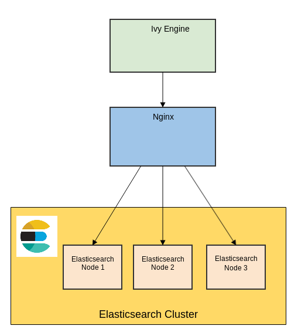

# ivy-elasticsearch-cluster

Setup of an ivy engine with an external elasticsearch cluster.

## Troubleshooting

Maybe you face the following issue with the elasticsearch container: `Max virtual memory areas vm.max_map_count [65530] likely too low, increase to at least [262144]` In this case you must increase vm.max_map_count: `sudo sysctl -w vm.max_map_count=262144`
