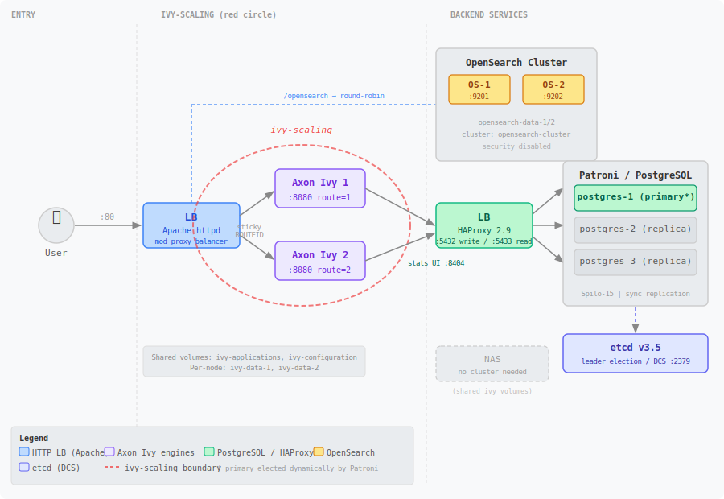
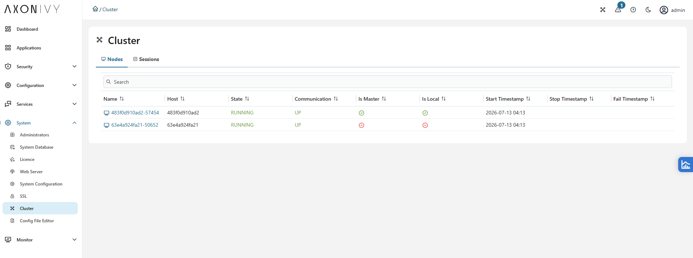

# Axon Ivy Cluster with Apache httpd, HAProxy, and PostgreSQL HA

This example shows how to scale Axon Ivy Engine with Docker Compose using:

- **Apache httpd** as the HTTP load balancer for Ivy engine nodes and OpenSearch
- **HAProxy** as the TCP load balancer for PostgreSQL (write + read endpoints)
- **Patroni + etcd** for PostgreSQL high-availability with automatic failover
- **OpenSearch** cluster for Ivy's search engine





---

## Start

```bash
docker compose up -d
```

---

## Access Points

| Service | URL / Address | Credentials |
|---|---|---|
| Axon Ivy (via Apache LB) | http://localhost | — |
| Apache Balancer Manager | http://localhost/balancer-manager | — |
| Engine Cockpit – Cluster View | http://localhost/system/faces/view/engine-cockpit/cluster.xhtml | admin / admin |
| OpenSearch health (via Apache) | http://localhost/opensearch/_cluster/health | — |
| OpenSearch node 1 (direct) | http://localhost:9201 | — |
| OpenSearch node 2 (direct) | http://localhost:9202 | — |
| HAProxy Stats UI | http://localhost:8404/stats | admin / admin |
| PostgreSQL write endpoint | localhost:5432 | postgres / postgres |
| PostgreSQL read endpoint | localhost:5433 | postgres / postgres |
| Patroni REST – postgres-1 | http://localhost:8001 | — |
| Patroni REST – postgres-2 | http://localhost:8002 | — |
| Patroni REST – postgres-3 | http://localhost:8003 | — |

---

## Architecture

### HTTP layer — Apache httpd

[Apache HTTP Server](https://httpd.apache.org/) (with `mod_proxy_balancer`) acts as
the front door for all traffic on port 80:

- Requests to `/` are round-robin load balanced across **ivy-1** and **ivy-2** with
  sticky sessions via the `ROUTEID` cookie — each user session stays pinned to one
  Ivy node.
- Requests to `/opensearch` are round-robin proxied across **opensearch-1** and
  **opensearch-2**.

Check the `ROUTEID` cookie in your browser to confirm which Ivy node you are
routed to. You can also manipulate the cookie to manually switch between routes.

### PostgreSQL HA layer — HAProxy + Patroni + etcd

[HAProxy](https://www.haproxy.org/) provides two PostgreSQL endpoints:

| Port | Purpose | Routing |
|---|---|---|
| **5432** | Write (primary only) | HAProxy checks Patroni `/primary` — only the leader returns HTTP 200 |
| **5433** | Read (replicas only) | HAProxy checks Patroni `/replica` — round-robin across standbys |

[Patroni](https://github.com/zalando/patroni) manages a 3-node PostgreSQL 15 cluster
(via the Spilo image) backed by [etcd](https://etcd.io/) for distributed consensus and
leader election. The cluster runs with synchronous replication enabled — one replica
always stays in sync with the leader.

---

## Patroni Cluster Status

Check current cluster state:

```bash
docker exec -it ivy-ha-postgres-1-1 patronictl list
```

Expected output:

```
+ Cluster: postgres-cluster -------------+---------+----+-----------+
| Member     | Host       | Role         | State   | TL | Lag in MB |
+------------+------------+--------------+---------+----+-----------+
| postgres-1 | 172.18.0.5 | Leader       | running |  1 |           |
| postgres-2 | 172.18.0.7 | Sync Standby | running |  1 |         0 |
| postgres-3 | 172.18.0.6 | Replica      | running |  1 |         0 |
+------------+------------+--------------+---------+----+-----------+
```

| Role | Description |
|---|---|
| **Leader** | Primary node — accepts all write operations (INSERT, UPDATE, DELETE). Source of truth. |
| **Sync Standby** | Synchronous replica — the Leader waits for this node to acknowledge each WAL record before committing. Stronger durability, slightly higher write latency. |
| **Replica** | Asynchronous replica — streams changes continuously but the Leader does not wait for it. Lower latency, small risk of data loss on sudden Leader failure. |

---

## Testing

### T-01 — Ivy load balancer

Open in browser: http://localhost/balancer-manager

Both **ivy-1** and **ivy-2** must show status **OK**.

### T-02 — OpenSearch cluster health

```bash
curl http://localhost/opensearch/_cluster/health
```

Expected: `"status":"green"` or `"yellow"`, `"number_of_nodes":2`

### T-03 — HAProxy PostgreSQL stats

Open in browser: http://localhost:8404/stats (admin / admin)

Both `postgres_primary` and `postgres_replicas` backends must be visible and active.

### T-04 — PostgreSQL write endpoint (primary check)

```bash
docker exec -it ivy-ha-postgres-1-1 psql -U postgres -c "SELECT pg_is_in_recovery();"
```

Expected: `f` (false = this node is the primary, not in recovery)

### T-05 — PostgreSQL read endpoint (replica check)

```bash
docker exec -it ivy-ha-postgres-2-1 psql -U postgres -c "SELECT pg_is_in_recovery();"
```

Expected: `t` (true = this node is a standby replica)

### T-06 — Patroni cluster nodes

```bash
docker exec -it ivy-ha-postgres-1-1 patronictl list
```

Expected: one Leader, one Sync Standby, one Replica — all `running`, lag `0`.

### T-07 — Patroni HA failover

```bash
# Stop the current primary
docker compose stop postgres-1

# Wait ~30 seconds for leader TTL, then confirm new primary elected
curl http://localhost:8002/primary
curl http://localhost:8003/primary
# The new primary returns HTTP 200; the other returns 503
```

HAProxy stats reflects the new primary automatically: http://localhost:8404/stats

---

## Stop

```bash
docker compose down
```

To remove all volumes (full reset):

```bash
docker compose down -v
```

---

## Points to Improve

### 1. etcd single node — no etcd cluster

The current setup runs a single `etcd` instance. If it goes down, Patroni cannot
perform leader election and the PostgreSQL cluster becomes read-only or unavailable.

**Next step:** Run etcd as a 3-node cluster (odd number for quorum) to make the DCS
layer itself highly available.

### 2. No dedicated OpenSearch load balancer

Apache httpd currently handles OpenSearch proxying via the `/opensearch` path rule.
This couples HTTP and search traffic on the same process and makes it harder to scale
OpenSearch independently.

**Next step:** Add a dedicated HAProxy (or nginx) service as an OpenSearch load balancer,
similar to `postgres-lb`, and point both Apache and Ivy directly at it.

### 3. Replace Apache httpd with HAProxy for HTTP load balancing

Apache is used here primarily as a reverse proxy / load balancer, which is not its
strength. HAProxy is purpose-built for this and offers better performance, richer health
checks, and a cleaner configuration for load balancing scenarios.

**Next step:** Replace the `loadbalancer` Apache service with HAProxy configured for
HTTP mode, using `balance roundrobin` with cookie-based sticky sessions for Ivy and a
separate backend for OpenSearch.

---
## Troubleshooting
Maybe you face the following issue with the opensearch container: `Max
virtual memory areas vm.max_map_count [65530] likely too low, increase to at
least [262144]` In this case you must increase vm.max_map_count: `sudo sysctl -w
vm.max_map_count=262144`

