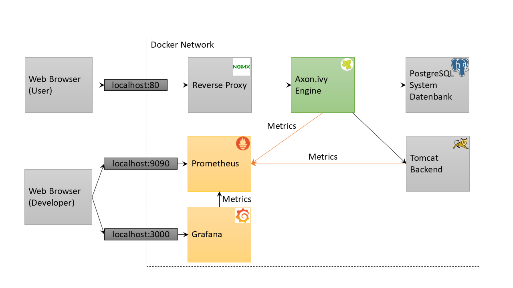
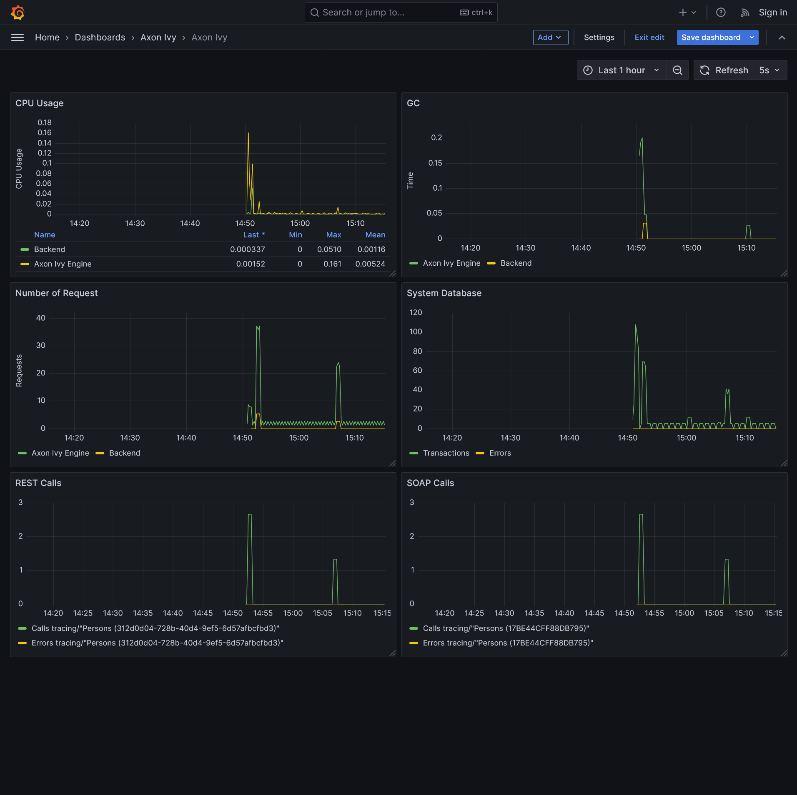

# ivy-monitoring-prometheus

This example shows how you can monitor a complex system involving multiple different services including Axon Ivy Engine. This helps to identify
performance bottle necks in your system.

After starting this example with `docker compose up` you can go to http://localhost to start some processes by using user `ivy` with password `ivy`. Navigate to http://localhost:3000/grafana to see 
and analyze the monitoring dashboard in Grafana.

## Prometheus
[Prometheus](https://prometheus.io/) is an open-source systems monitoring and alerting toolkit. It scrapes and stores time series data.

## Grafana
With [Grafana](https://grafana.com/) you can create, explore, and share all of your data through beautiful, flexible dashboards.

## OpenTelemetry

The [OpenTelemetry](https://opentelemetry.io/) library collects traces and metrics in a system and exports them to a monitoring tool (e.g., Prometheus).
The library provides a Java agent that instruments a Java application (e.g., Axon Ivy Engine, Tomcat, etc.) and collects metrics information.
Additional metrics can be read from JMX and exported to Prometheus using a configuration file (e.g., [ivy-jmx-metrics.yaml](ivy/ivy-jmx-metrics.yaml)).

## JMX
[Java Management Extension](https://en.wikipedia.org/wiki/Java_Management_Extensions) is a technology to read and write runtime information from a Java processes.
This allows monitoring tools to monitor the state the Axon Ivy Engine. The Engine Cockpit has an MBean View that allows to browse and read these information.
OpenTelemetry uses JMX to read metrics from Java processes and to export them to different external monitoring tools like Prometheus.
