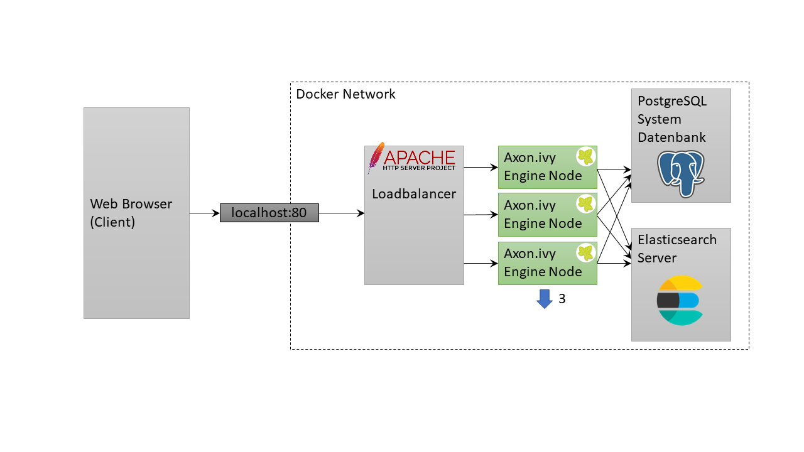
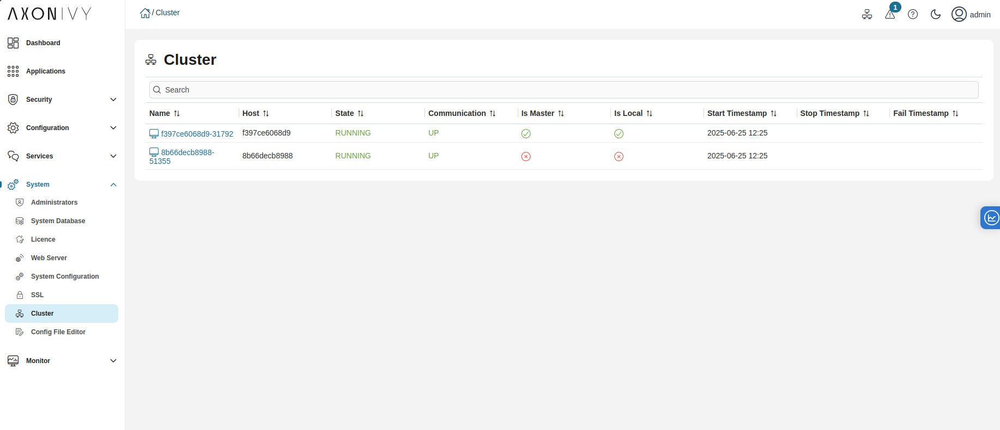

# Axon Ivy Cluster with Apache httpd as Loadbalancer

This example shows how to scale Axon Ivy Engine with docker compose and Apache
HTTP Server.

After starting this example you can simply go to http://localhost

Status of the load balancer can be checked at http://localhost/balancer-manager

Have a look at the [Cluster
view](http://localhost/system/faces/view/engine-cockpit/cluster.xhtml) in the
Engine Cockpit to see the current running nodes

## Sticky routing with cookie

This example configures the Ivy cluster with sticky sessions (via routing
cookie). 

Can check the ROUTEID cookie in your browser to see the current route.

You can also manipulate the cookie to manually switch between routes.

## Apache HTTP Server

[Apache HTTP Server](https://httpd.apache.org/), colloquially called Apache, is
a free open source HTTP server.

Apache offers a [Docker image](https://hub.docker.com/_/httpd) that can be used
as a simple load balancer in docker environments. For advanced requirements we
recommend using it in a Kubernetes environment. Have a look at
[compose.yml](compose.yml) file on how to configure Apache HTTP
Server as a load balancer for an Ivy Cluster.
