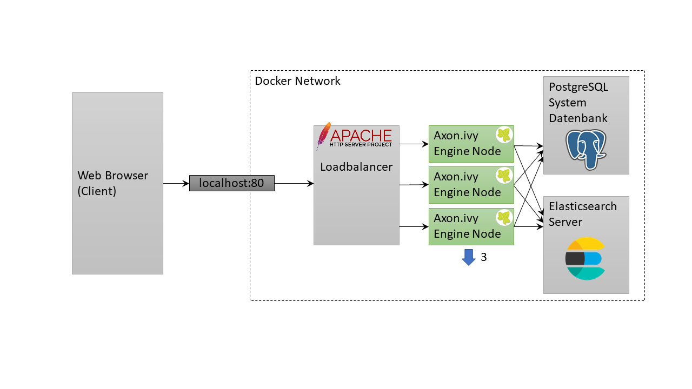
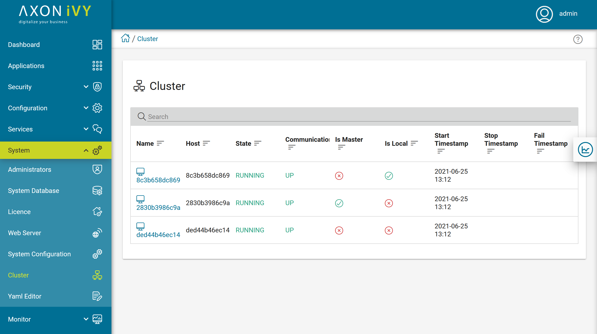

# ivy-scaling-apache

This example shows how to scale Axon Ivy Engine with docker compose and Apache
HTTP Server.

After starting this example you can simply go to http://localhost

## Scale Up

By default, two Axon Ivy Engine node are running. You can scale up three Axon
Ivy Engine nodes with the following command:

`docker compose up -d --scale ivy=3`

Have a look at the [Cluster
view](http://localhost/system/faces/view/engine-cockpit/cluster.xhtml) in the
Engine Cockpit to see the current running nodes

This example configures the Ivy cluster with sticky sessions (via routing
cookie).

## Scale Down

You can scale down Axon Ivy Engine to two nodes with the following command:

`docker compose up -d --scale ivy=2`

## Apache HTTP Server

[Apache HTTP Server](https://httpd.apache.org/), colloquially called Apache, is
a free open source HTTP server.

Apache offers a [Docker image](https://hub.docker.com/_/httpd) that can be used
as a simple load balancer in docker environments. For advanced requirements we
recommend using it in a Kubernetes environment. Have a look at
[compose.yml](compose.yml) file on how to configure Apache HTTP
Server as a load balancer for an Ivy Cluster.
