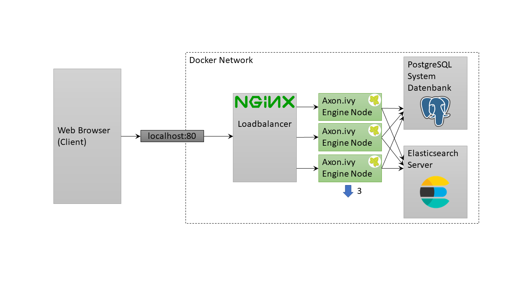
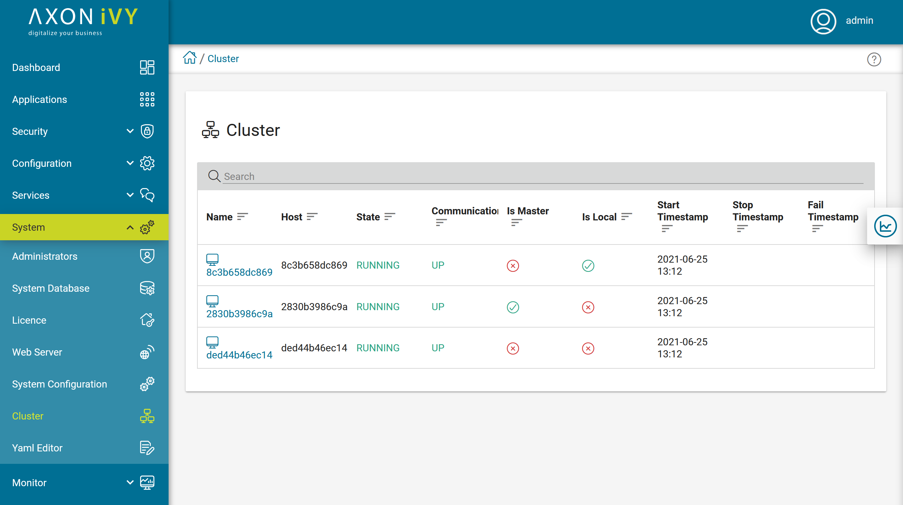

# ivy-scaling-nginx

This example shows how to scale Axon Ivy Engine with docker-compose and NGINX.

After starting this example you can simply go to http://localhost

## Scale Up

By default, two Axon Ivy Engine node are running. You can scale up three Axon
Ivy Engine nodes with the following command:

`docker-compose up -d --scale ivy=3`

Have a look at the [Cluster
view](http://localhost/system/faces/view/engine-cockpit/cluster.xhtml) in the
Engine Cockpit to see the current running nodes

This example configures the Ivy cluster with sticky sessions (via ip_hash).

## Scale Down

You can scale down Axon Ivy Engine to two nodes with the following command:

`docker-compose up -d --scale ivy=2`

## NGINX

[NGINX](https://nginx.org/) is a free, open source HTTP and reverse proxy
server, a mail proxy server, and a generic TCP/UDP proxy server with load
balancing features.

NGINX offers a [Docker image](https://hub.docker.com/_/nginx) that can be used
as a simple load balancer in docker environments. For advanced requirements we
recommend using NGINX in a Kubernetes environment. Have a look at
[docker-compose.yml](docker-compose.yml) file on how to configure NGINX as a
load balancer for an Ivy Cluster.

## Limitations

NGINX in the free version can not properly scale up and scale down at runtime.
For production you need to use the PRO version.
