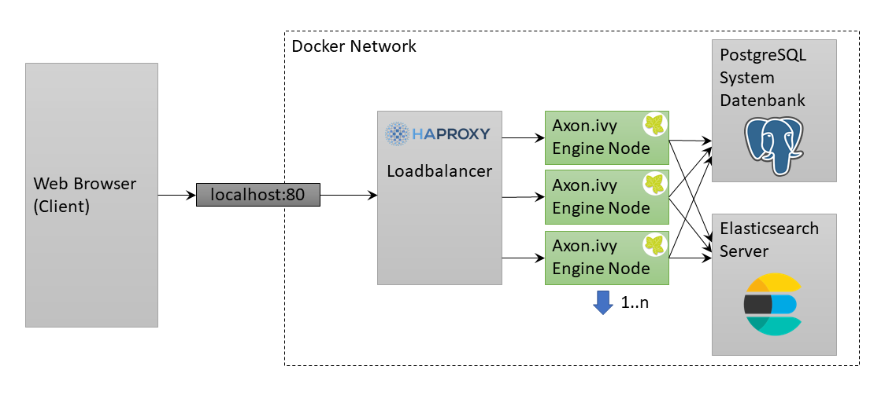

# ivy-scaling

This example shows how to scale Axon Ivy Engine.

After starting this example you can simply go to http://localhost

## Scale Up

By default one node of Axon Ivy Engine is running. You can scale up Axon Ivy Engine to five nodes with the following command:

`docker-compose up -d --scale ivy=5`

Have a look at the [Cluster view](http://localhost/system/faces/view/engine-cockpit/cluster.xhtml) in the Engine Cockpit to see the current running nodes

## Scale Down

You can scale down Axon Ivy Engine to two nodes with the following command:

`docker-compose up -d --scale ivy=2`

## HAProxy

[HAProxy](https://www.haproxy.org/) is a free, open source high availability solution, providing
load balancing and proxying for TCP and HTTP-based applications by spreading requests across
multiple servers.

Because it is very easy to setup and also offers a [Docker image](https://hub.docker.com/_/haproxy)
that only needs minimal configuration, we use this load balancer for our scaling sample. Have a
look at [docker-compose.yml](docker-compose.yml) file on how to configure HAProxy as a load
balancer for an Ivy Cluster.
