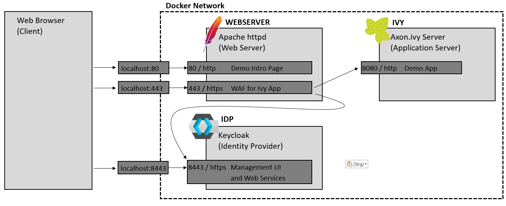

# ivy-sso-openidc-apache-keycloak

This repository shows you how to setup Open ID Connect including all needed components:
- Axon.ivy Server acting as application server
- Apache httpd with mod_auth_openidc acting as web application firewall and authentication endpoint
- Keycloak acting as ID Provider

## How to use

After running the docker composition, visit http://localhost

## Guide to config files in this sample

- docker-compose.yml -- definition of the Docker composition
- idp-config -- Folder containing configuration for Keycloak
-- export-ivy-demo-realm.sh -- script to export current Keycloak configuration into the JSON file. Can be used in case you did some configuration changed and want to persist them for later use. To use this script, you must run it on the container's console.
-- realm-ivydemo-import.json -- Keycloak realm data which will be loaded on startup of the container.
- webserver -- Folder containing configuration of the web server and authentication endpoint
-- Dockerfile
-- 000-default.conf -- VHost configuration for startup page without any security
-- default-ssl.conf -- VHost configuration for secured site, including the Open ID Connect config with [mod_auth_openidc](https://github.com/zmartzone/mod_auth_openidc)
-- default-site-html -- Containing some HTML pages to guide you through this sample and also small PHP script for dumping the data we get after authentication
- ivy-config -- Folder containing configuration for Axon.ivy
-- context.xml -- Here we define the SSL valve which will use the user name from HTTP header to initialize the Axon.ivy session.
-- header_logger_valve_1.0.1.jar -- Valve used for dumping all HTTP header into the logs. Only used for debugging.
-- ivy.yaml -- Configuration of Axon.ivy context and web server frontend URL.
-- log4jconfig.xml -- Lower log levels, so we can see more about what's happening on the console.

## Currently not provided / not solved

- Improve documentation
- Solve issues with self-signed HTTPS certs
- sync users beween Ivy and Keycloak with LDAP?

