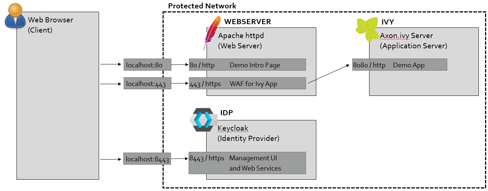

# ivy-sso-saml-apache-keycloak

This repository shows you how to setup SAML 2.0 including all needed components:
- Axon.ivy Engine acting as application server
- Apache httpd acting as web application firewall and authentication endpoint
- Keycloak acting as SAML 2.0 ID Provider

## How to use

After running Docker compose, visit http://localhost

## Guide to config files in this sample

|file|description|
|---|---|
| docker-compose.yml | definition of the Docker compose |
| idp-config | Folder containing configuration for Keycloak |
| - export-ivy-demo-realm.sh | script to export current Keycloak configuration into the JSON file. Can be used in case you did some configuration changed and want to persist them for later use. To use this script, you must run it on the container's console.|
| - realm-ivydemo-import.json | Keycloak realm data which will be loaded on startup of the container. |
| webserver | Folder containing configuration of the web server and authentication endpoint |
| - Dockerfile | Build the webserver docker container from a Ubuntu Linux image |
| - 000-default.conf | Virtual host (vhost) configuration for startup page without any security |
| - default-ssl.conf | Virtual host (vhost) configuration for secured site, including the SAML config with [mod_auth_mellon](https://github.com/latchset/mod_auth_mellon) |
| - default-site-html | Containing some HTML pages to guide you through this sample and small PHP script for dumping the data we get after authentication |
| - saml-config | Folder containing the configuration files we need for the SAML config |
| - - client-cert.pem | Certificate for signatures. |
| - - client-private-key.pem -- Private key for signatures. |
| - - idp-metadata.xml | SAML metadata for ID provider (exported from Keycloak) |
| - - sp-metadata.xml | SAML metadata for service provider. This means data of our Apache and mod_auth_mellon config. |
| ivy-config | Folder containing configuration for Axon.ivy |
| - context.xml | Here we define the SSL valve which will use the username from HTTP header to initialize the Axon.ivy session. |
| - ivy.yaml | Configuration of Axon.ivy context and web server frontend URL. |

## Currently not provided / not solved

- Issues with self-signed HTTPS certs
- Sync users between Ivy and Keycloak with LDAP?
