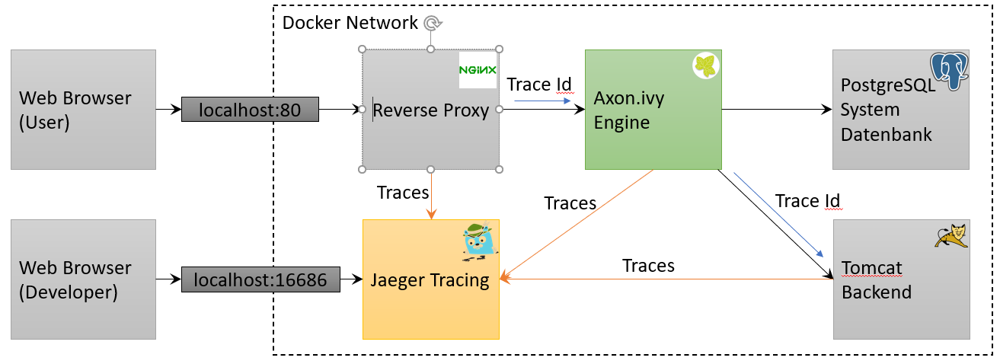
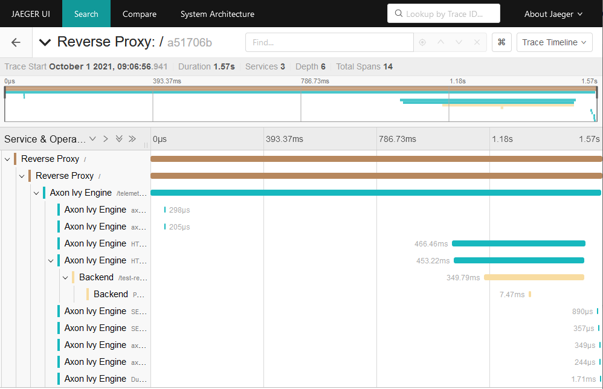

# ivy-tracing-jaeger

This example shows how you can trace requests in a complex system involving multiple different services including Axon Ivy Engine. This helps to identify
performance bottle necks in your system.

After starting this example with `docker-compose up` you can go to http://localhost to start some processes. Navigate to http://localhost:16686 to see 
and analyze the recorded traces.

## Jaeger Tracing

The [Jaeger tracing tool](https://www.jaegertracing.io/) collects traces from different systems and provides a UI to search and analyzes traces. 

## OpenTelemetry

The [OpenTelemetry](https://opentelemetry.io/) library collects traces and metrics in a system and exports them to a tracing tool (e.g., Jaeger). 
The library provides a Java agent that instruments a Java application (e.g., Axon Ivy Engine, Tomcat, etc.) and collects tracing information every 
where a request can ingress or outgress a Java process.

## Trace context propagation

To aggregate the different traces from the different system a unique trace id is generated at the Reverse Proxy. 
This trace id is then propagated with a special Jaeger specific HTTP header (`uber-trace-id`) from the Reverse Proxy to every other 
involved system (e.g., Axon Ivy Engine, Tomcat, etc.)

## W3C standard trace context propagation

There is also a [W3C standard](https://www.w3.org/TR/trace-context/) that defines standard HTTP header (`traceparent`) and format to 
propagate a trace context in a vendor neutral way.

