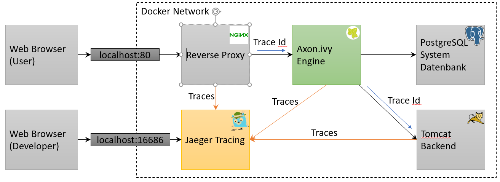
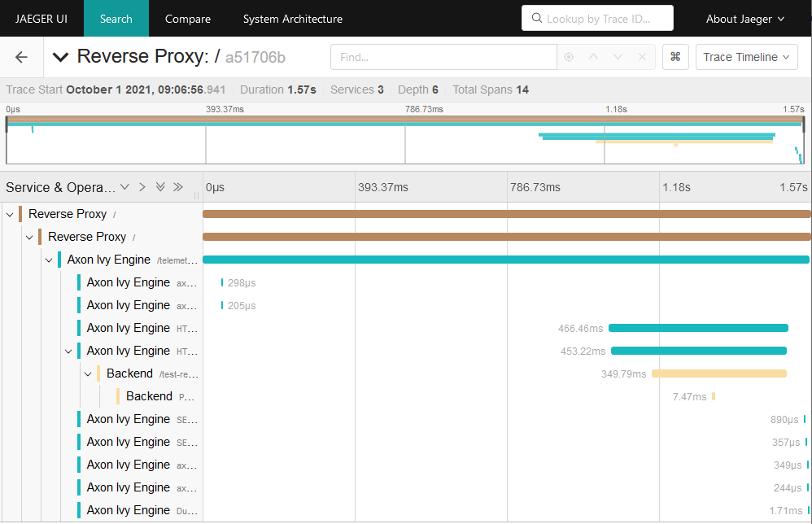

# ivy-tracing

These example demonstrates tracing support of Axon Ivy Engine in a complex system involving multiple services.

- [ivy-tracing-agent](./ivy-tracing-agent/README.md)
- [ivy-tracing-otlp](./ivy-tracing-otlp/README.md)

## System Landscape
Both variants record traces in a production ready environment.

## Trace context propagation

To aggregate the different traces from the different system a unique trace id is generated at the Reverse Proxy. 
This trace id is then propagated from the Reverse Proxy to every other involved system over HTTP 
using the [W3C Trace Context](https://www.w3.org/TR/trace-context/) HTTP headers (`traceparent` and `tracestate`).

## Jaeger UI

After starting on of the examples with `docker compose up` you can go to http://localhost to start some processes. 
Navigate to http://localhost:16686 to see and analyze the recorded traces.

